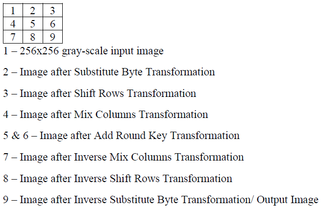
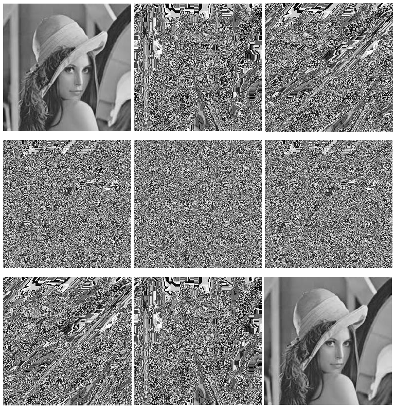
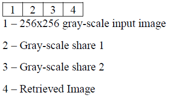
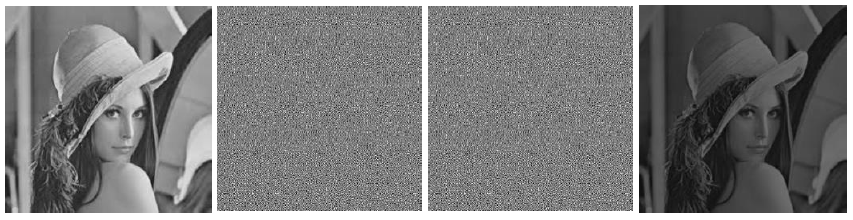

# Visual-Cryptography
#### Using Python and OpenCV to implement two cryptography algorithms: one which uses AES encryption & decryption and another which uses bit-level encryption to generate two shares which when superposed, the secret image is revealed.
 

Here are sample results:  
 

**Advance Encryption Standard (AES) algorithm**:
 
 
 

**Visual Cryptography for Gray-scale Images Using Bit-level**:
 
 
 

**Refer the 'Project Report' for an in-depth understanding.**
